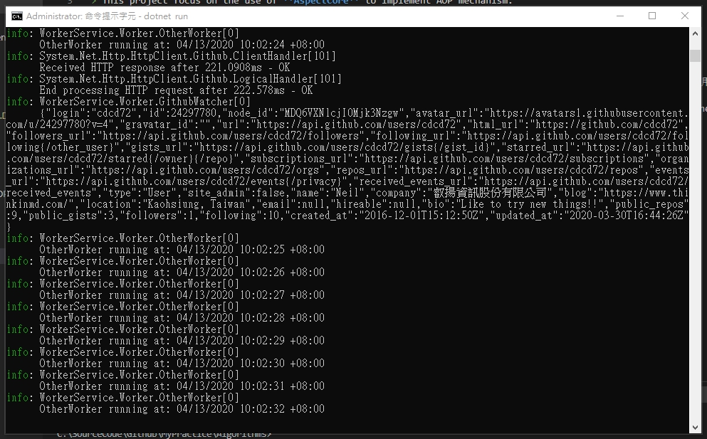

# NetCore.WorkerService.Demo
> 這個專案專注於實作 Worker Service。  
> This project focus on implement worker service.  

練習使用 .NET Core 3.1  實作 Worker Service。  
To practice how worker service implement with .NET Core 3.1.  

## 運行專案
> 透過 Visual Studio 2019 或者利用 `dotnet run` 指令先把專案跑起來。  
1. Run the project from Visual Studio 2019 or by typing `dotnet run` in a command window  

> 接著如看到下圖，表示 Worker Service 已在運行中。  
2. Then as shown in the figure below, the worker service is already running.  

> 你可以嘗試修改組態設定！  
3. You can try to modify configuration settings!  

## 最後版本
1.0.0.0 (April 10, 2020)

## 記錄
* 1.0.0.0
  * Initial Commit (初次上版)

## 參考文章
* Chinese
  * [在 ASP.NET Core 中使用託管服務的背景工作](https://docs.microsoft.com/zh-tw/aspnet/core/fundamentals/host/hosted-services?view=aspnetcore-3.1&tabs=visual-studio)  
  * [Upgrade net core2.2 app to net core3.1 as worker service](https://medium.com/ricos-note/upgrade-net-core2-2-app-to-net-core3-1-as-worker-service-cdf5aa6a329e)  
* English
  * [Introduction to Worker Services in .NET Core 3.0](https://medium.com/@nickfane/introduction-to-worker-services-in-net-core-3-0-4bb3fc631225)  
  * [Creating a Worker Service in ASP .NET Core 3.0](https://medium.com/swlh/creating-a-worker-service-in-asp-net-core-3-0-6af5dc780c80)  